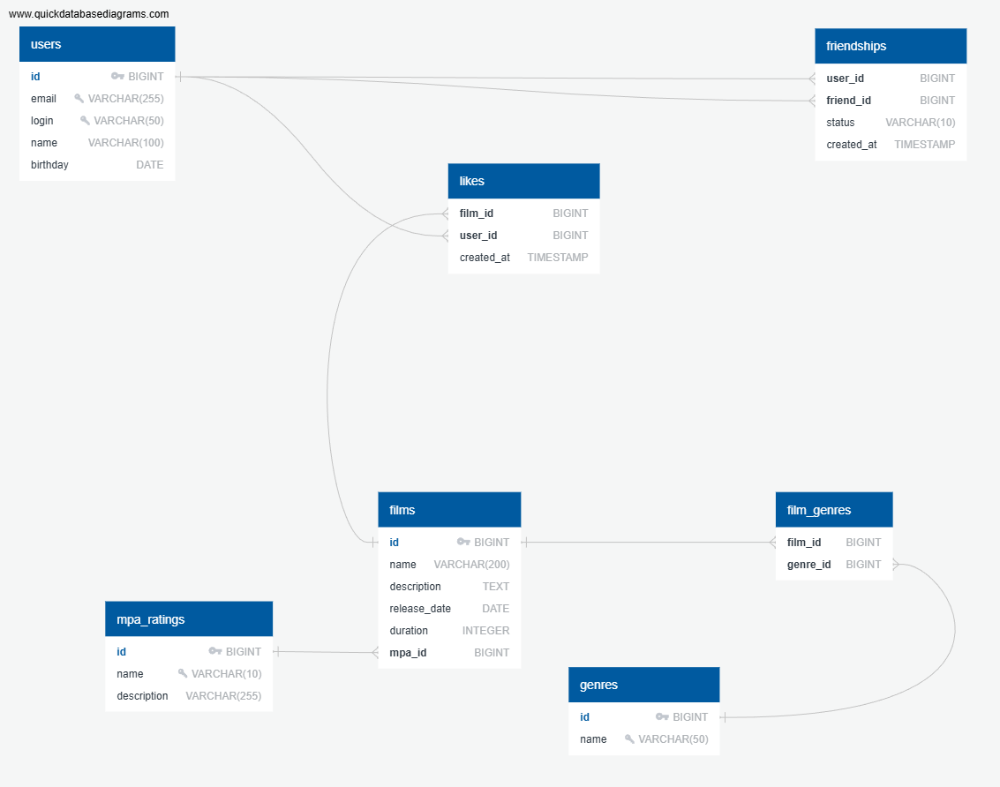

# Filmorate

## Схема базы данных



### Описание таблиц

**Основные таблицы:**

- `users` - пользователи системы
- `films` - фильмы
- `mpa_ratings` - возрастные рейтинги (G, PG, PG-13, R, NC-17)
- `genres` - жанры фильмов (Комедия, Драма и др.)

**Таблицы связей:**

- `film_genres` - связь фильмов с жанрами (многие-ко-многим)
- `likes` - лайки пользователей фильмам
- `friendships` - дружеские связи между пользователями со статусами (PENDING/CONFIRMED)

### Особенности логики приложения:

1. **Дружба является автоматически взаимной** - при добавлении друга связь устанавливается сразу в обе стороны
2. **Жанры сортируются по ID** при отображении фильма
3. **Лайки учитываются** для определения популярных фильмов
4. **Валидация данных** выполняется на уровне приложения:
    - Email и логин уникальны
    - Дата релиза фильма не раньше 28.12.1895
    - Дата рождения пользователя не в будущем

### Примеры SQL запросов для основных операций

**1. Получение топ-N популярных фильмов (по количеству лайков):**

```sql
SELECT f.id, 
       f.name, 
       f.description, 
       f.release_date, 
       f.duration,
       m.name as mpa_name, 
       m.description as mpa_description,
       COUNT(l.user_id) as likes_count
FROM films f
LEFT JOIN likes l ON f.id = l.film_id
LEFT JOIN mpa_ratings m ON f.mpa_id = m.id
GROUP BY f.id, m.name, m.description
ORDER BY likes_count DESC, f.id
LIMIT ?;
```

**2. Получение фильма с его жанрами (отсортированными по ID):**

```sql
SELECT f.*, 
       m.name as mpa_name, 
       m.description as mpa_description,
       g.id as genre_id, 
       g.name as genre_name
FROM films f
LEFT JOIN mpa_ratings m ON f.mpa_id = m.id
LEFT JOIN film_genres fg ON f.id = fg.film_id
LEFT JOIN genres g ON fg.genre_id = g.id
WHERE f.id = ?
ORDER BY g.id;
```

**3. Получение списка друзей пользователя:**

```sql
-- Друзья, где пользователь является user_id
SELECT u.* 
FROM users u
INNER JOIN friendships f ON u.id = f.friend_id
WHERE f.user_id = ?

UNION

-- Друзья, где пользователь является friend_id
SELECT u.* 
FROM users u
INNER JOIN friendships f ON u.id = f.user_id
WHERE f.friend_id = ?

ORDER BY id;
```

## Полная схема базы данных для приложения Filmorate

### ПОЛЬЗОВАТЕЛИ

### Таблица для хранения информации о пользователях

users

```sql
id PK BIGINT                # Первичный ключ, автоинкремент
email VARCHAR(255) UNIQUE   # Уникальный email
login VARCHAR(50) UNIQUE    # Уникальный логин (без пробелов)
name VARCHAR(100)           # Имя для отображения (может быть пустым)
birthday DATE               # Дата рождения
```

### РЕЙТИНГИ MPA

### Справочная таблица возрастных рейтингов

mpa_ratings

```sql
id PK BIGINT                # Первичный ключ
name VARCHAR(10) UNIQUE     # Код рейтинга: G, PG, PG-13, R, NC-17
description VARCHAR(255)    # Описание рейтинга 
```

### ЖАНРЫ

### Справочная таблица жанров фильмов

genres

```sql
id PK BIGINT              # Первичный ключ
name VARCHAR(50) UNIQUE   # Название жанра: Комедия, Драма и т.д.
```

### ФИЛЬМЫ

### Основная таблица для хранения информации о фильмах

films

```sql
id PK BIGINT                        # Первичный ключ, автоинкремент
name VARCHAR(200)                   # Название фильма
description TEXT                    # Описание (макс.
release_date DATE                   # Дата выхода
duration INTEGER                    # Продолжительность (мин.)
mpa_id BIGINT FK >- mpa_ratings.id  # Внешний ключ на рейтинг MPA
```

### СВЯЗЬ ФИЛЬМЫ-ЖАНРЫ

### Связь многие-ко-многим между фильмами и жанрами

film_genres

```sql
film_id BIGINT FK >- films.id    # Внешний ключ на фильм
genre_id BIGINT FK >- genres.id  # Внешний ключ на жанр
# Составной первичный ключ: (film_id, genre_id)
```

### ЛАЙКИ

### Связь многие-ко-многим для лайков пользователей

likes

```sql
film_id BIGINT FK >- films.id    # Внешний ключ на фильм
user_id BIGINT FK >- users.id    # Внешний ключ на пользователя
created_at TIMESTAMP             # Дата и время создания лайка
# Составной первичный ключ: (film_id, user_id)
```

### ДРУЖБА

### Связь многие-ко-многим для дружбы между пользователями

friendships

```sql
user_id BIGINT FK >- users.id    # Внешний ключ на пользователя (меньший ID)
friend_id BIGINT FK >- users.id  # Внешний ключ на друга (больший ID)
status VARCHAR(10)               # Статус: CONFIRMED (всегда)
created_at TIMESTAMP             # Дата создания дружбы
# Составной первичный ключ: (user_id, friend_id)
# Ограничение: user_id < friend_id (для предотвращения дублирования)
# Проверка: user_id != friend_id
```